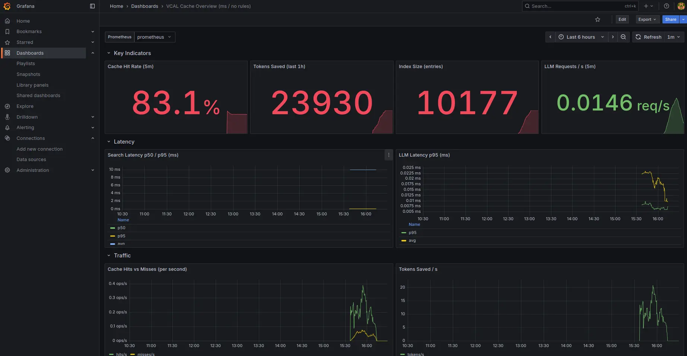

# VCAL-core

**VCAL-core** is a lightweight, in‑process [HNSW](https://arxiv.org/abs/1603.09320) vector index written in safe Rust with optional AVX2 SIMD and optional JSON snapshots. It’s designed as a tiny building block for **semantic caches** (e.g., deduplicate LLM prompts) and embedded ANN search.

> **MSRV:** 1.56 (edition 2021). *Dev‑dependencies/benches may require a newer stable toolchain.*

---

## Why VCAL‑core?

- **Ultra‑light:** minimal dependencies, no `unsafe` in the public API.
- **Fast enough:** competitive k‑NN for small/mid indexes (cache/local apps).
- **Embeddable:** runs in‑process, no daemon; works in server, function, and edge contexts.
- **Deterministic:** single‑threaded core (easy to reason about). Wrap in a `RwLock` if you need concurrent reads.
- **Batteries optional:** snapshots, SIMD, benches are opt‑in.

---

## Features

- HNSW index with greedy descent + `ef_search` on layer 0
- Pluggable metrics: **Cosine** (default) and **Dot**
- **Optional** AVX2 fast‑path (`--features simd` + `RUSTFLAGS="-C target-cpu=native"`)
- **Optional** JSON snapshots behind the `serde` feature
- Tiny error type (`VcalError`) and `Result` alias
- No I/O, no threads, no background tasks in core

> Not yet (planned): upsert/delete, TTL/eviction, batch search, official LangChain/LlamaIndex adapters, WASM/WASI packaging, CLI utilities.

---

## Install

Add to your `Cargo.toml` (local path while private):

```toml
[dependencies]
vcal-core = { path = ".", default-features = true }
```

Enable optional features as needed:

- SIMD (x86_64 AVX2):  
  `RUSTFLAGS="-C target-cpu=native" cargo build --release --features simd`
- Snapshots (JSON via `serde_json`): enabled by default feature `serde`

---

## Quick start (Rust)

```rust
use vcal_core::{HnswBuilder, Cosine};

fn main() -> Result<(), Box<dyn std::error::Error>> {
    // 1) Build an index for 128‑D using defaults (e.g., M≈16, ef_search≈128)
    let mut idx = HnswBuilder::<Cosine>::default()
        .dims(128)
        .build();

    // 2) Insert vectors with your external ids
    idx.insert(vec![0.1; 128], 1001)?;
    idx.insert(vec![0.5; 128], 1002)?;
    idx.insert(vec![0.9; 128], 1003)?;

    // 3) Search k nearest
    let hits = idx.search(&vec![0.11; 128], 5)?; // Vec<(ext_id, distance)>
    println!("Top‑5: {hits:?}");

    Ok(())
}
```

### Snapshot & restore (feature `serde`)

```rust
use vcal_core::{HnswBuilder, Cosine, to_bytes, from_slice};

let mut idx = HnswBuilder::<Cosine>::default().dims(8).build();
idx.insert(vec![0.5; 8], 7)?;

let bytes = to_bytes(&idx);                // JSON bytes
let restored = from_slice::<Cosine>(&bytes)?;
assert_eq!(restored.search(&vec![0.5; 8], 1)?[0].0, 7);
```

> Snapshots are a convenience for small/mid indexes. For large indexes, consider a binary format (future opt‑in).

---

## 📈 Observability (Prometheus/Grafana)

VCAL exposes Prometheus metrics so you can track cache efficiency, latency, and saved tokens from day one.

## What VCAL exports

**Counters**
- vcal_cache_hits_total — number of cache hits
- vcal_cache_misses_total — number of cache misses
- vcal_llm_requests_total — LLM fallbacks (post-miss)
- vcal_tokens_saved_total — rough token savings from cache

**Histograms**
- vcal_search_latency_seconds — HNSW search time
- vcal_llm_latency_seconds — LLM call time (if your app records it)

**Gauges**
- vcal_index_size — number of cached Q/A entries
-vcal_snapshot_unixtime — Unix time of the last snapshot

> Your application (Rust/Python wrapper) should expose the metrics endpoint; the library is metrics-agnostic.

### 1) Expose metrics

Python example (using prometheus_client):

```python
from prometheus_client import start_http_server
start_http_server(9108)  # Exposes http://localhost:9108/metrics
```

Rust example (quick & simple with hyper or axum):

```rust
// Pseudocode — serve `prometheus::gather()` at /metrics on 0.0.0.0:9108
```

### 2) Prometheus scrape config

Add a job to your prometheus.yml:

```yaml
scrape_configs:
  - job_name: vcal_cache
    static_configs:
      - targets: ["localhost:9108"]
```

Reload Prometheus (or restart it if reload isn’t enabled).

### 3) Grafana quick start

1. Add Prometheus as a data source (URL usually http://localhost:9090).
2. Create a new dashboard, then add panels using the PromQL below.
3. (Optional) Add an “Observability” section to your dashboard with hit rate, latencies, and tokens saved.

> If you’re using Grafana Cloud, just point the data source to your Cloud Prometheus endpoint.

## Quick PromQL:
Hit rate (5 min window):

```promql
rate(vcal_cache_hits_total[5m]) / (rate(vcal_cache_hits_total[5m]) + rate(vcal_cache_misses_total[5m]))
```

Tokens saved per minute:
```promql
rate(vcal_tokens_saved_total[1m])
```

p95 search latency:
```promql
histogram_quantile(0.95, rate(vcal_search_latency_seconds_bucket[5m]))
```

p95 LLM latency (if instrumented):
```promql
histogram_quantile(0.95, rate(vcal_llm_latency_seconds_bucket[5m]))
```

Snapshot age (minutes):
```promql
(max(time()) - vcal_snapshot_unixtime) / 60
```

Index size:
```promql
vcal_index_size
```
### Example panels to add

- Cache Hit Rate — line: the PromQL for hit rate (above).
- Search Latency p50/p95 — 2 single-stats or lines using histogram_quantile(0.5/0.95, …).
- LLM Fallback Rate — line: rate(vcal_llm_requests_total[5m]).
- Tokens Saved/min — bar/area: rate(vcal_tokens_saved_total[1m]).
- Index Size — single-stat: vcal_index_size.
- Snapshot Age — single-stat: snapshot age query (minutes).



---

## Tuning & performance tips

- **Release builds:** `cargo build --release`
- **SIMD:** `RUSTFLAGS="-C target-cpu=native" cargo build --release --features simd`
- **Normalize embeddings** for Cosine (L2‑unit vectors) to avoid degenerate cases.
- **Parameters:**
  - `m` ~ 16–32 is a good start (graph connectivity).
  - `ef_search` trades speed vs recall; try 64–256 (higher = better recall, slower).
- **Threading:** core is single‑threaded; for concurrent reads, wrap in `parking_lot::RwLock` at the app layer.

---

## Design notes

- No background threads or I/O abstractions in core.
- No public `unsafe`. AVX2 intrinsics are runtime‑checked (when `simd` is enabled).
- Snapshots serialize only what’s needed; the node **level** is derived from `links.len() - 1`.

---

## Current limitations

- No **upsert / delete** (additive indexes)
- No **TTL / eviction** or memory quota
- No **batch search**
- No official adapters (LangChain/LlamaIndex) yet
- No WASM/WASI packaging & CLI in the core crate (planned separately)
- Large‑scale ANN (100M+ vectors) is out of scope; the goal is **embedded/local** use

---

## Benchmarks (optional, local)

If you include benches locally:

```bash
cargo bench
# With SIMD:
RUSTFLAGS="-C target-cpu=native" cargo bench --features simd
```

(We intentionally keep benches out of the minimal public crate to reduce dependencies.)

---

## Versioning & MSRV

- **MSRV:** 1.56 (edition 2021). We try not to bump it without a breaking release.
- SemVer: minor versions may add APIs; major versions may change public APIs.

---

## Contributing

PRs and issues are welcome! Please:

- Run `cargo fmt` and `cargo clippy --all-targets --all-features`
- Keep changes small and focused
- Add tests for new behavior
- Avoid adding dependencies unless strictly justified

If you contribute code, you agree to license your work under the project’s license.

---

## Security

This crate is pure Rust with no `unsafe` in the public API. If you discover a security issue, please disclose responsibly via a private channel first.

---

## License

Licensed under **Apache‑2.0**. See `LICENSE-Apache-2.0`.

© VCAL-project contributors.
